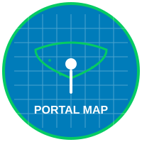

# PortalMap

Based on [https://github.com/yopaseopor/osmpoismap](https://github.com/yopaseopor/osmpoismap)

# Portal Map 🗺️

<h2>🌐 Languages / Idiomas / Idiomes</h2>

- [English](#english-version) 🇬🇧
- [Español](#versión-en-español) 🇪🇸
- [Català](#versió-en-català) 🇦🇩
- [Français](#version-française) 🇫🇷
- [Italiano](#versione-italiana) 🇮🇹
- [Deutsch](#deutsche-version) 🇩🇪
- [Dansk](#dansk-version) 🇩🇰
- [Euskera](#euskera-bertsioa) 🇪🇺
- [Galego](#versión-galega) 🇬🇦
- [Aragonés](#versión-aragonesa) 🇦🇷
- [Asturianu](#versión-asturiana) 🇦🇸

---

# 🌐 Portal Map 🗺️ (English)

**Advanced OpenStreetMap viewer with routing, street imagery, search, multi-language support, and 3D visualization**

Portal Map is a comprehensive web-based OpenStreetMap viewer featuring advanced mapping capabilities, extensive search tools, multiple data overlays, street-level imagery integration, routing functionality, and full 3D terrain visualization.

## 🌟 Key Features

### 🗺️ Advanced Map Viewer
- **Multiple base maps**: OpenStreetMap Standard, OpenStreetMap DE, OpenStreetMap FR, MapTiler Basic, Versatiles Colorful, Custom Yopaseopor Style
- **Satellite & Aerial Imagery**: Esri Satellite, IGN PNOA (Spain), ICGC (Catalonia)
- **Vector tile rendering** with custom styles for enhanced visualization
- **3D Terrain View**: Full Cesium.js integration with terrain provider and dynamic base layer switching
- **Interactive controls**: Zoom, rotation, coordinates display, scale bar, geolocation

### 🔍 Advanced Search & Query System
- **Key Search**: Search OpenStreetMap keys with autocomplete from Taginfo API
- **Value Search**: Search tag values with yes/no definitions option
- **Element Type Filtering**: Filter by nodes, ways, or relations
- **Query Statistics**: Real-time execution time, element counts, and performance metrics
- **Tag Query Builder**: Construct complex Overpass API queries with URL parameter support
- **Nominatim Integration**: Address and place name search

### 🎯 Data Visualization & Overlays
- **Category Overlays**: Education (schools, universities, libraries), Food, Health, Services, Shopping, Transport, Government, Animal facilities
- **Custom Overlay System**: Modular overlay architecture for easy extension
- **Real-time Data**: Live Overpass API queries with bbox strategy for efficient large-area coverage
- **Metadata Display**: OSM user information, changesets, timestamps, and editing history
- **Opening Hours**: Intelligent parsing and display of facility hours with current status
- **Feature Statistics**: Overlay summary showing active layers and tagged element counts

### 🌍 Comprehensive Multilingual Support
- **12 languages available**: English, Spanish, Catalan, French, Italian, German, Danish, Basque, Galician, Aragonese, Asturian
- **Dynamic translation system** with real-time language switching
- **Localized tag suggestions** from Taginfo API for each language
- **Interface adaptation** for each supported language

### 🖼️ Street-Level Imagery Integration
- **Mapillary Viewer**: 360° street-level imagery with coverage indicators
- **Panoramax Viewer**: Open-source street imagery alternative
- **Kartaview Integration**: Additional street imagery source
- **Seamless switching** between map and imagery views

### 🛣️ Routing & Navigation
- **Multi-provider routing**: OpenRouteService, GraphHopper, BRouter, OSRM
- **Route visualization** with turn-by-turn directions
- **Export capabilities** for various navigation apps
- **Custom routing profiles** for different transportation modes

### 🔗 Extensive External Integrations

#### OSM Editing Tools
- iD Editor, JOSM, Potlatch 2, Level0, RapiD Editor

#### Complementary Maps & Services
- Google Maps, HERE WeGo, Bing Maps, Apple Maps
- Qwant Maps, Mapy.cz, Windy (weather overlay)
- OpenStreetBrowser, Tracesmap

#### Specialized Mapping Tools
- MapComplete themes (addresses, playgrounds, recycling, hydrants, diets, baby facilities, crossings)
- OSM Hydrants, Keep Right validation, Geofabrik Tools
- Waymarked Trails, OpenCampingMap, WheelMap accessibility
- OpenLevelUp, F4Map 3D, Streets.gl 3D

#### Community & Validation Tools
- Latest OSM Edits per Tile, OSMCha changeset analysis
- OSM Notes, Notes Review, OSMose validation
- Keep Right error detection

#### Specialized Portal Maps
- OSM Accessibility Map, OSM Baby Map, OSM Eat & Drink Map
- OSM Fire Fighters Map, OSM Historic Map, OSM Indoor Map
- OSM Lit Map, OSM Limits Map, OSM Library Map
- OSM Pets Map, OSM Sports Map, OSM Parking Map
- OSM Recycling Map, OSM Validator Map, OSM POIs Map

### 📱 Mobile & Responsive Design
- **Adaptive interface** for desktop, tablet, and mobile devices
- **Touch-optimized controls** with gesture support
- **Responsive overlays** that work across all screen sizes
- **Mobile menu system** for compact navigation

### 🌐 URL Sharing & API
- **Permalink generation** with map state preservation
- **URL parameters** for direct linking to specific views, searches, and overlays
- **Browser history integration** with back/forward navigation support
- **Share functionality** with clipboard integration

## 🛠️ Technical Architecture

- **Frontend**: Vanilla JavaScript with OpenLayers 7.5.2 and Cesium.js 1.95 for 3D
- **Mapping Engine**: OpenLayers with ol-cesium for 2D/3D integration
- **Data Sources**:
  - OpenStreetMap via multiple Overpass API endpoints (with automatic fallback)
  - Taginfo API for tag suggestions and definitions
  - MapTiler Vector Tiles with custom styling
  - Esri, IGN, ICGC for satellite/aerial imagery
- **APIs**: Mapillary, Nominatim, Overpass, Taginfo
- **Translations**: Custom dynamic translation system with 12 language support
- **Styling**: Responsive CSS with mobile-first approach
- **Performance**: Efficient vector tile rendering, bbox query strategy, lazy loading

## 📊 Data Sources & APIs

### Primary Data Sources
- **OpenStreetMap**: Core geographic data via Overpass API
- **Taginfo API**: Tag suggestions, definitions, and statistics
- **Mapillary API**: Street-level imagery metadata
- **Nominatim**: Address and place name geocoding

### Map Tile Providers
- **MapTiler**: Vector tiles with API key authentication
- **OpenStreetMap**: Standard tiles and country-specific variants
- **Esri**: Satellite imagery (World Imagery)
- **IGN Spain**: PNOA aerial imagery
- **ICGC Catalonia**: Orthophoto imagery

### External Service Integrations
- **Routing APIs**: OpenRouteService, GraphHopper, BRouter, OSRM
- **Street Imagery**: Mapillary, Panoramax, Kartaview
- **Weather Data**: Windy API integration
- **Validation Tools**: Keep Right, OSMose, Notes Review

## 🚀 How to Use

1. **Choose Base Map**: Select from various map styles in the layer panel
2. **Enable 3D View**: Toggle 3D terrain visualization with the cube button
3. **Search & Filter**: Use key/value search with element type filters
4. **Apply Overlays**: Activate category overlays (education, food, transport, etc.)
5. **View Street Imagery**: Click imagery buttons to explore street-level photos
6. **Get Directions**: Use routing controls for navigation planning
7. **Explore Details**: Click map features to view OSM metadata and opening hours
8. **Share Location**: Use permalink to share specific map views
9. **Switch Language**: Change interface language with the language selector
10. **Edit OSM**: Use integrated editing tools to contribute to OpenStreetMap

## 🌐 Live Demo

**Try Portal Map**: [https://yopaseopor.github.io/portalmap](https://yopaseopor.github.io/portalmap)

## 📖 URL Parameters & API

Portal Map supports extensive URL parameters for deep linking:

- `lat`, `lon`, `zoom`: Map position and zoom level
- `base`: Base layer index
- `lang`: Interface language
- `key=value`: Tag search parameters
- `tag=key:value[element_types]`: Advanced tag queries
- `map=zoom/lat/lon/rotation`: Permalink format

Example: `?lat=41.69689&lon=1.59647&zoom=8&lang=en&tag=amenity:school[nwr]`

## 🎯 Development Process

### Vibe Coding Experience

Portal Map was primarily developed using the **vibe coding** technique, a creative and intuitive software development approach that prioritizes:

- **Rapid experimentation** with ideas and features
- **Creative integration** of multiple inspiration sources
- **Iterative development** based on immediate needs
- **Constant adaptation** to changes and improvements

#### Main Tools Used:
- **Cursor** with models like Claude Sonnet 3.5 and ChatGPT 4.0
- **Windsurf** with ChatGPT 4.1, Deepseek, Gemini 2.5, SWE-1, and code-supernova-1 million
- **Visual Studio Code** with Copilot and ChatGPT 4.1

#### Development Scripts & Tools
- **Taginfo Downloader**: Automated tag definition retrieval
- **Translation Consolidator**: CSV translation management
- **Overlay Generators**: Automated overlay creation from data sources
- **XML Structure Validators**: OSM data validation tools

## 📄 License

Open source - see the LICENSE file for details.

## 🔗 Related Links

- [OpenStreetMap](https://www.openstreetmap.org)
- [OpenLayers](https://openlayers.org)
- [Cesium.js](https://cesium.com)
- [Overpass API](https://overpass-api.de)
- [Taginfo API](https://taginfo.openstreetmap.org)
- [MapComplete](https://mapcomplete.org)
- [Mapillary](https://mapillary.com)

---

**Portal Map** - Your comprehensive portal for exploring and contributing to OpenStreetMap.

---

# 🌐 Portal Map 🗺️ (Español)

**Visor avanzado de OpenStreetMap con routing, imágenes de calle, búsqueda, soporte multiidioma y visualización 3D**

Portal Map es un visor web integral de OpenStreetMap con capacidades avanzadas de mapeo, herramientas extensas de búsqueda, múltiples capas de datos, integración de imágenes a nivel de calle, funcionalidad de routing y visualización completa de terreno en 3D.

## 🌟 Características principales

### 🗺️ Visor avanzado de mapas
- **Múltiples mapas base**: OpenStreetMap Estándar, OpenStreetMap DE, OpenStreetMap FR, MapTiler Basic, Versatiles Colorful, Estilo Personalizado Yopaseopor
- **Imágenes satelitales y aéreas**: Esri Satellite, IGN PNOA (España), ICGC (Cataluña)
- **Renderizado de teselas vectoriales** con estilos personalizados para visualización mejorada
- **Vista de terreno 3D**: Integración completa de Cesium.js con proveedor de terreno y cambio dinámico de capas base
- **Controles interactivos**: Zoom, rotación, visualización de coordenadas, barra de escala, geolocalización

### 🔍 Sistema avanzado de búsqueda y consultas
- **Búsqueda por clave**: Buscar claves de OpenStreetMap con autocompletado desde la API Taginfo
- **Búsqueda por valor**: Buscar valores de etiquetas con opción de definiciones sí/no
- **Filtrado por tipo de elemento**: Filtrar por nodos, vías o relaciones
- **Estadísticas de consulta**: Tiempo de ejecución en tiempo real, recuentos de elementos y métricas de rendimiento
- **Constructor de consultas por etiqueta**: Construir consultas complejas de Overpass API con soporte de parámetros URL
- **Integración Nominatim**: Búsqueda de direcciones y nombres de lugares

### 🎯 Visualización de datos y superposiciones
- **Superposiciones por categorías**: Educación (escuelas, universidades, bibliotecas), Alimentación, Salud, Servicios, Compras, Transporte, Gobierno, Instalaciones para animales
- **Sistema de superposiciones personalizables**: Arquitectura modular de superposiciones para fácil extensión
- **Datos en tiempo real**: Consultas API Overpass en vivo con estrategia bbox para cobertura eficiente de áreas grandes
- **Visualización de metadatos**: Información de usuario OSM, changesets, marcas de tiempo e historial de ediciones
- **Horarios de apertura**: Análisis inteligente y visualización de horarios de instalaciones con estado actual
- **Estadísticas de elementos**: Resumen de superposiciones mostrando capas activas y recuentos de elementos etiquetados

### 🌍 Soporte multilingüe integral
- **12 idiomas disponibles**: Inglés, Español, Catalán, Francés, Italiano, Alemán, Danés, Vasco, Gallego, Aragonés, Asturiano
- **Sistema de traducción dinámica** con cambio de idioma en tiempo real
- **Sugerencias de etiquetas localizadas** desde la API Taginfo para cada idioma
- **Adaptación de interfaz** para cada idioma soportado

### 🖼️ Integración de imágenes a nivel de calle
- **Visor Mapillary**: Imágenes de calle de 360° con indicadores de cobertura
- **Visor Panoramax**: Alternativa de imágenes de calle de código abierto
- **Integración Kartaview**: Fuente adicional de imágenes de calle
- **Cambio fluido** entre vistas de mapa e imágenes

### 🛣️ Routing y navegación
- **Routing multi-proveedor**: OpenRouteService, GraphHopper, BRouter, OSRM
- **Visualización de rutas** con direcciones paso a paso
- **Capacidades de exportación** para diversas aplicaciones de navegación
- **Perfiles de routing personalizados** para diferentes modos de transporte

### 🔗 Integraciones externas extensas

#### Herramientas de edición OSM
- Editor iD, JOSM, Potlatch 2, Level0, Editor RapiD

#### Mapas y servicios complementarios
- Google Maps, HERE WeGo, Bing Maps, Apple Maps
- Mapas Qwant, Mapy.cz, Windy (superposición meteorológica)
- OpenStreetBrowser, Tracesmap

#### Herramientas de mapeo especializadas
- Temas MapComplete (direcciones, parques infantiles, reciclaje, hidrantes, dietas, instalaciones para bebés, pasos de peatones)
- OSM Hydrants, Keep Right validación, Herramientas Geofabrik
- Waymarked Trails, OpenCampingMap, WheelMap accesibilidad
- OpenLevelUp, F4Map 3D, Streets.gl 3D

#### Comunidad y herramientas de validación
- Latest OSM Edits per Tile, OSMCha análisis de changesets
- Notas OSM, Notes Review, Validación OSMose
- Keep Right detección de errores

#### Mapas especializados del portal
- Mapa de Accesibilidad OSM, Mapa de Bebés OSM, Mapa de Comidas OSM
- Mapa de Bomberos OSM, Mapa Histórico OSM, Mapa Interior OSM
- Mapa de Iluminación OSM, Mapa de Límites OSM, Mapa de Biblioteca OSM
- Mapa de Mascotas OSM, Mapa Deportivo OSM, Mapa de Aparcamiento OSM
- Mapa de Reciclaje OSM, Mapa Validador OSM, Mapa de POIs OSM

### 📱 Diseño móvil y responsive
- **Interfaz adaptativa** para escritorio, tablet y dispositivos móviles
- **Controles optimizados para touch** con soporte de gestos
- **Superposiciones responsive** que funcionan en todos los tamaños de pantalla
- **Sistema de menú móvil** para navegación compacta

### 🌐 Compartir URL y API
- **Generación de enlaces permanentes** con preservación del estado del mapa
- **Parámetros URL** para enlaces directos a vistas, búsquedas y superposiciones específicas
- **Integración con historial del navegador** con soporte de navegación atrás/adelante
- **Funcionalidad de compartir** con integración del portapapeles

## 🛠️ Arquitectura técnica

- **Frontend**: JavaScript puro con OpenLayers 7.5.2 y Cesium.js 1.95 para 3D
- **Motor de mapeo**: OpenLayers con ol-cesium para integración 2D/3D
- **Fuentes de datos**:
  - OpenStreetMap vía múltiples endpoints API Overpass (con fallback automático)
  - API Taginfo para sugerencias de etiquetas y definiciones
  - Teselas vectoriales MapTiler con estilos personalizados
  - Esri, IGN, ICGC para imágenes satelitales/aéreas
- **APIs**: Mapillary, Nominatim, Overpass, Taginfo
- **Traducciones**: Sistema de traducción dinámica personalizado con soporte para 12 idiomas
- **Estilos**: CSS responsive con enfoque mobile-first
- **Rendimiento**: Renderizado eficiente de teselas vectoriales, estrategia de consulta bbox, carga diferida

## 📊 Fuentes de datos y APIs

### Fuentes de datos principales
- **OpenStreetMap**: Datos geográficos principales vía API Overpass
- **API Taginfo**: Sugerencias de etiquetas, definiciones y estadísticas
- **API Mapillary**: Metadatos de imágenes a nivel de calle
- **Nominatim**: Geocodificación de direcciones y nombres de lugares

### Proveedores de teselas de mapa
- **MapTiler**: Teselas vectoriales con autenticación de clave API
- **OpenStreetMap**: Teselas estándar y variantes por país
- **Esri**: Imágenes satelitales (World Imagery)
- **IGN España**: Imágenes aéreas PNOA
- **ICGC Cataluña**: Imágenes ortofoto

### Integraciones de servicios externos
- **APIs de routing**: OpenRouteService, GraphHopper, BRouter, OSRM
- **Imágenes de calle**: Mapillary, Panoramax, Kartaview
- **Datos meteorológicos**: Integración API Windy
- **Herramientas de validación**: Keep Right, OSMose, Notes Review

## 🚀 Cómo usar

1. **Elegir mapa base**: Seleccionar entre varios estilos de mapa en el panel de capas
2. **Habilitar vista 3D**: Alternar visualización de terreno 3D con el botón del cubo
3. **Buscar y filtrar**: Usar búsqueda clave/valor con filtros de tipo de elemento
4. **Aplicar superposiciones**: Activar superposiciones de categorías (educación, alimentación, transporte, etc.)
5. **Ver imágenes de calle**: Hacer clic en botones de imágenes para explorar fotos a nivel de calle
6. **Obtener direcciones**: Usar controles de routing para planificación de navegación
7. **Explorar detalles**: Hacer clic en elementos del mapa para ver metadatos OSM y horarios de apertura
8. **Compartir ubicación**: Usar enlace permanente para compartir vistas específicas del mapa
9. **Cambiar idioma**: Cambiar idioma de interfaz con el selector de idioma
10. **Editar OSM**: Usar herramientas de edición integradas para contribuir a OpenStreetMap

## 🌐 Demo en directo

**Prueba Portal Map**: [https://yopaseopor.github.io/portalmap](https://yopaseopor.github.io/portalmap)

## 📖 Parámetros URL y API

Portal Map soporta parámetros URL extensos para enlaces profundos:

- `lat`, `lon`, `zoom`: Posición del mapa y nivel de zoom
- `base`: Índice de capa base
- `lang`: Idioma de interfaz
- `key=value`: Parámetros de búsqueda de etiquetas
- `tag=key:value[element_types]`: Consultas avanzadas de etiquetas
- `map=zoom/lat/lon/rotation`: Formato de enlace permanente

Ejemplo: `?lat=41.69689&lon=1.59647&zoom=8&lang=es&tag=amenity:school[nwr]`

## 🎯 Proceso de desarrollo

### Experiencia Vibe Coding

Portal Map ha sido desarrollado principalmente utilizando la técnica de **vibe coding**, un enfoque creativo e intuitivo para el desarrollo de software que prioriza:

- **Experimentación rápida** con ideas y funcionalidades
- **Integración creativa** de múltiples fuentes de inspiración
- **Desarrollo iterativo** basado en necesidades inmediatas
- **Adaptabilidad constante** a los cambios y mejoras

#### Principales herramientas utilizadas:
- **Cursor** con modelos como Claude Sonnet 3.5 y ChatGPT 4.0
- **Windsurf** con ChatGPT 4.1, Deepseek, Gemini 2.5, SWE-1 y code-supernova-1 million
- **Visual Studio Code** con Copilot y ChatGPT 4.1

#### Scripts y herramientas de desarrollo
- **Descargador Taginfo**: Recuperación automatizada de definiciones de etiquetas
- **Consolidador de traducciones**: Gestión de traducciones CSV
- **Generadores de superposiciones**: Creación automatizada de superposiciones desde fuentes de datos
- **Validadores de estructura XML**: Herramientas de validación de datos OSM

## 📄 Licencia

Código abierto - consulta el archivo LICENSE para más detalles.

## 🔗 Enlaces relacionados

- [OpenStreetMap](https://www.openstreetmap.org)
- [OpenLayers](https://openlayers.org)
- [Cesium.js](https://cesium.com)
- [API Overpass](https://overpass-api.de)
- [API Taginfo](https://taginfo.openstreetmap.org)
- [MapComplete](https://mapcomplete.org)
- [Mapillary](https://mapillary.com)

---

**Portal Map** - Tu portal integral para explorar y contribuir a OpenStreetMap.

---

# 🌐 Portal Map 🗺️ (Català)

**Visor avançat d'OpenStreetMap amb routing, imatges de carrer, cerca, suport multiidioma i visualització 3D**

Portal Map és un visor web integral d'OpenStreetMap amb capacitats avançades de mapatge, eines extensives de cerca, múltiples capes de dades, integració d'imatges a nivell de carrer, funcionalitat de routing i visualització completa de terreny en 3D.

## 🌟 Característiques principals

### 🗺️ Visor avançat de mapes
- **Múltiples mapes base**: OpenStreetMap Estàndard, OpenStreetMap DE, OpenStreetMap FR, MapTiler Basic, Versatiles Colorful, Estil Personalitzat Yopaseopor
- **Imatges satel·litals i aèries**: Esri Satellite, IGN PNOA (Espanya), ICGC (Catalunya)
- **Renderitzat de teseles vectorials** amb estils personalitzats per a visualització millorada
- **Vista de terreny 3D**: Integració completa de Cesium.js amb proveïdor de terreny i canvi dinàmic de capes base
- **Controls interactius**: Zoom, rotació, visualització de coordenades, barra d'escala, geolocalització

### 🔍 Sistema avançat de cerca i consultes
- **Cerca per clau**: Cercar claus d'OpenStreetMap amb autocompletat des de l'API Taginfo
- **Cerca per valor**: Cercar valors d'etiquetes amb opció de definicions sí/no
- **Filtratge per tipus d'element**: Filtrar per nodes, vies o relacions
- **Estadístiques de consulta**: Temps d'execució en temps real, recomptes d'elements i mètriques de rendiment
- **Constructor de consultes per etiqueta**: Construir consultes complexes d'Overpass API amb suport de paràmetres URL
- **Integració Nominatim**: Cerca d'adreces i noms de llocs

### 🎯 Visualització de dades i superposicions
- **Superposicions per categories**: Educació (escoles, universitats, biblioteques), Alimentació, Salut, Serveis, Compres, Transport, Govern, Instal·lacions per a animals
- **Sistema de superposicions personalitzables**: Arquitectura modular de superposicions per a fàcil extensió
- **Dades en temps real**: Consultes API Overpass en viu amb estratègia bbox per a cobertura eficient d'àrees grans
- **Visualització de metadades**: Informació d'usuari OSM, changesets, marques de temps i historial d'edicions
- **Horaris d'obertura**: Anàlisi intel·ligent i visualització d'horaris d'instal·lacions amb estat actual
- **Estadístiques d'elements**: Resum de superposicions mostrant capes actives i recomptes d'elements etiquetats

### 🌍 Suport multiidioma integral
- **12 idiomes disponibles**: Anglès, Castellà, Català, Francès, Italià, Alemany, Danès, Basc, Gallec, Aragonès, Asturià
- **Sistema de traducció dinàmica** amb canvi d'idioma en temps real
- **Suggeriments d'etiquetes localitzades** des de l'API Taginfo per a cada idioma
- **Adaptació d'interfície** per a cada idioma suportat

### 🖼️ Integració d'imatges a nivell de carrer
- **Visor Mapillary**: Imatges de carrer de 360° amb indicadors de cobertura
- **Visor Panoramax**: Alternativa d'imatges de carrer de codi obert
- **Integració Kartaview**: Font addicional d'imatges de carrer
- **Canvi fluid** entre vistes de mapa i imatges

### 🛣️ Routing i navegació
- **Routing multi-proveïdor**: OpenRouteService, GraphHopper, BRouter, OSRM
- **Visualització de rutes** amb direccions pas a pas
- **Capacitats d'exportació** per a diverses aplicacions de navegació
- **Perfils de routing personalitzats** per a diferents modes de transport

### 🔗 Integracions externes extenses

#### Eines d'edició OSM
- Editor iD, JOSM, Potlatch 2, Level0, Editor RapiD

#### Mapes i serveis complementaris
- Google Maps, HERE WeGo, Bing Maps, Apple Maps
- Mapes Qwant, Mapy.cz, Windy (superposició meteorològica)
- OpenStreetBrowser, Tracesmap

#### Eines de mapatge especialitzades
- Temes MapComplete (adreces, parcs infantils, reciclatge, hidrants, dietes, instal·lacions per a nadons, passos de vianants)
- OSM Hydrants, Keep Right validació, Eines Geofabrik
- Waymarked Trails, OpenCampingMap, WheelMap accessibilitat
- OpenLevelUp, F4Map 3D, Streets.gl 3D

#### Comunitat i eines de validació
- Latest OSM Edits per Tile, OSMCha anàlisi de changesets
- Notes OSM, Notes Review, Validació OSMose
- Keep Right detecció d'errors

#### Mapes especialitzats del portal
- Mapa d'Accessibilitat OSM, Mapa de Nadons OSM, Mapa de Menjars OSM
- Mapa de Bombers OSM, Mapa Històric OSM, Mapa Interior OSM
- Mapa d'Enllumenat OSM, Mapa de Límits OSM, Mapa de Biblioteca OSM
- Mapa de Mascotes OSM, Mapa Esportiu OSM, Mapa d'Aparcament OSM
- Mapa de Reciclatge OSM, Mapa Validador OSM, Mapa de POIs OSM

### 📱 Disseny mòbil i responsive
- **Interfície adaptativa** per a escriptori, tauleta i dispositius mòbils
- **Controls optimitzats per touch** amb suport de gestos
- **Superposicions responsive** que funcionen en totes les mides de pantalla
- **Sistema de menú mòbil** per a navegació compacta

### 🌐 Compartir URL i API
- **Generació d'enllaços permanents** amb preservació de l'estat del mapa
- **Paràmetres URL** per a enllaços directos a vistes, cerques i superposicions específiques
- **Integració amb historial del navegador** amb suport de navegació enrere/endavant
- **Funcionalitat de compartir** amb integració del porta-retalls

## 🛠️ Arquitectura tècnica

- **Frontend**: JavaScript pur amb OpenLayers 7.5.2 i Cesium.js 1.95 per a 3D
- **Motor de mapatge**: OpenLayers amb ol-cesium per a integració 2D/3D
- **Fonts de dades**:
  - OpenStreetMap via múltiples endpoints API Overpass (amb fallback automàtic)
  - API Taginfo per a suggeriments d'etiquetes i definicions
  - Teseles vectorials MapTiler amb estils personalitzats
  - Esri, IGN, ICGC per a imatges satel·litals/aèries
- **APIs**: Mapillary, Nominatim, Overpass, Taginfo
- **Traduccions**: Sistema de traducció dinàmica personalitzat amb suport per a 12 idiomes
- **Estils**: CSS responsive amb enfocament mobile-first
- **Rendiment**: Renderitzat eficient de teseles vectorials, estratègia de consulta bbox, càrrega diferida

## 📊 Fonts de dades i APIs

### Fonts de dades principals
- **OpenStreetMap**: Dades geogràfiques principals via API Overpass
- **API Taginfo**: Suggeriments d'etiquetes, definicions i estadístiques
- **API Mapillary**: Metadades d'imatges a nivell de carrer
- **Nominatim**: Geocodificació d'adreces i noms de llocs

### Proveïdors de teseles de mapa
- **MapTiler**: Teseles vectorials amb autenticació de clau API
- **OpenStreetMap**: Teseles estàndard i variants per país
- **Esri**: Imatges satel·litals (World Imagery)
- **IGN Espanya**: Imatges aèries PNOA
- **ICGC Catalunya**: Imatges ortofoto

### Integracions de serveis externs
- **APIs de routing**: OpenRouteService, GraphHopper, BRouter, OSRM
- **Imatges de carrer**: Mapillary, Panoramax, Kartaview
- **Dades meteorològiques**: Integració API Windy
- **Eines de validació**: Keep Right, OSMose, Notes Review

## 🚀 Com utilitzar

1. **Triar mapa base**: Seleccionar entre diversos estils de mapa al panell de capes
2. **Habilitar vista 3D**: Alternar visualització de terreny 3D amb el botó del cub
3. **Cercar i filtrar**: Usar cerca clau/valor amb filtres de tipus d'element
4. **Aplicar superposicions**: Activar superposicions de categories (educació, alimentació, transport, etc.)
5. **Veure imatges de carrer**: Fer clic als botons d'imatges per explorar fotos a nivell de carrer
6. **Obtenir direccions**: Usar controls de routing per a planificació de navegació
7. **Explorar detalls**: Fer clic als elements del mapa per veure metadades OSM i horaris d'obertura
8. **Compartir ubicació**: Usar enllaç permanent per compartir vistes específiques del mapa
9. **Canviar idioma**: Canviar idioma d'interfície amb el selector d'idioma
10. **Editar OSM**: Usar eines d'edició integrades per contribuir a OpenStreetMap

## 🌐 Demo en directe

**Prova Portal Map**: [https://yopaseopor.github.io/portalmap](https://yopaseopor.github.io/portalmap)

## 📖 Paràmetres URL i API

Portal Map suporta paràmetres URL extensos per a enllaços profunds:

- `lat`, `lon`, `zoom`: Posició del mapa i nivell de zoom
- `base`: Índex de capa base
- `lang`: Idioma d'interfície
- `key=value`: Paràmetres de cerca d'etiquetes
- `tag=key:value[element_types]`: Consultes avançades d'etiquetes
- `map=zoom/lat/lon/rotation`: Format d'enllaç permanent

Exemple: `?lat=41.69689&lon=1.59647&zoom=8&lang=ca&tag=amenity:school[nwr]`

## 🎯 Procés de desenvolupament

### Experiència Vibe Coding

Portal Map ha estat desenvolupat principalment utilitzant la tècnica de **vibe coding**, un enfocament creatiu i intuïtiu per al desenvolupament de programari que prioritza:

- **Experimentació ràpida** amb idees i funcionalitats
- **Integració creativa** de múltiples fonts d'inspiració
- **Desenvolupament iteratiu** basat en necessitats immediates
- **Adaptabilitat constant** als canvis i millores

#### Principals eines utilitzades:
- **Cursor** amb models com Claude Sonnet 3.5 i ChatGPT 4.0
- **Windsurf** amb ChatGPT 4.1, Deepseek, Gemini 2.5, SWE-1 i code-supernova-1 million
- **Visual Studio Code** amb Copilot i ChatGPT 4.1

#### Scripts i eines de desenvolupament
- **Descarregador Taginfo**: Recuperació automatitzada de definicions d'etiquetes
- **Consolidador de traduccions**: Gestió de traduccions CSV
- **Generadors de superposicions**: Creació automatitzada de superposicions des de fonts de dades
- **Validators d'estructura XML**: Eines de validació de dades OSM

## 📄 Llicència

Codi obert - consulta el fitxer LICENSE per detalls.

## 🔗 Enllaços relacionats

- [OpenStreetMap](https://www.openstreetmap.org)
- [OpenLayers](https://openlayers.org)
- [Cesium.js](https://cesium.com)
- [API Overpass](https://overpass-api.de)
- [API Taginfo](https://taginfo.openstreetmap.org)
- [MapComplete](https://mapcomplete.org)
- [Mapillary](https://mapillary.com)

---

**Portal Map** - El teu portal integral per explorar i contribuir a OpenStreetMap.

---

# 🌐 Portal Map 🗺️ (Français)

**Visionneuse OpenStreetMap avancée avec routage, imagerie de rue, recherche, support multilingue et visualisation 3D**

Portal Map est une visionneuse web complète d'OpenStreetMap avec des capacités de cartographie avancées, des outils de recherche étendus, de multiples couches de données, une intégration d'images de rue, des fonctionnalités de routage et une visualisation complète du terrain en 3D.

---

# 🌐 Portal Map 🗺️ (Italiano)

**Visualizzatore OpenStreetMap avanzato con routing, immagini stradali, ricerca, supporto multilingue e visualizzazione 3D**

Portal Map è un visualizzatore web completo di OpenStreetMap con capacità di mappatura avanzate, strumenti di ricerca estesi, molteplici livelli di dati, integrazione di immagini stradali, funzionalità di routing e visualizzazione completa del terreno in 3D.

---

# 🌐 Portal Map 🗺️ (Deutsch)

**Erweiterte OpenStreetMap-Ansicht mit Routing, Straßenbildern, Suche, Mehrsprachigkeit und 3D-Visualisierung**

Portal Map ist eine umfassende webbasierte OpenStreetMap-Ansicht mit fortschrittlichen Kartierungsfunktionen, erweiterten Suchwerkzeugen, mehreren Datenebenen, Straßenbildintegration, Routing-Funktionalität und vollständiger 3D-Geländedarstellung.

---

# 🌐 Portal Map 🗺️ (Dansk)

**Avanceret OpenStreetMap-fremviser med routing, gadebilleder, søgning, flersproget support og 3D-visualisering**

Portal Map er en omfattende webbaseret OpenStreetMap-fremviser med avancerede kortlægningsmuligheder, udvidede søgeværktøjer, flere datalag, gadebilledintegration, routing-funktionalitet og komplet 3D-terrænvisualisering.

---

# 🌐 Portal Map 🗺️ (Euskera)

**OpenStreetMap ikustaile aurreratua routing-arekin, kale-irudiekin, bilaketarekin, hizkuntza-aniztasunarekin eta 3D bisualizazioarekin**

Portal Map OpenStreetMap-en web-ikustaile osoa da, mapaketa-gaitasun aurreratuekin, bilaketa-tresna hedatuekin, datu-geruza anitzekin, kale-irudi-integrazioarekin, routing-funtzionalitatearekin eta lur-masa 3D-ikuskizun osoarekin.

---

# 🌐 Portal Map 🗺️ (Galego)

**Visor avanzado de OpenStreetMap con routing, imaxes de rúa, busca, soporte multilingüe e visualización 3D**

Portal Map é un visor web integral de OpenStreetMap con capacidades avanzadas de mapeo, ferramentas extensas de busca, múltiples capas de datos, integración de imaxes a nivel de rúa, funcionalidade de routing e visualización completa de terreo en 3D.

---

# 🌐 Portal Map 🗺️ (Aragonés)

**Visor abanzato d'OpenStreetMap con routing, imáchens de ruga, busca, suporte multilinguál y visualización 3D**

Portal Map ye un visor web integrál d'OpenStreetMap con capacidatz abanzatas de mapeo, ferramientas extensas de busca, multiples capas de datos, integración d'imáchens a libel de ruga, funcionalidat de routing y visualización completa de terreno en 3D.

---

# 🌐 Portal Map 🗺️ (Asturianu)

**Visor avanzáu d'OpenStreetMap con routing, imáxenes de rúa, busca, sofitu multillingüe y visualización 3D**

Portal Map ye un visor web integral d'OpenStreetMap con capacidaes avanzaes de mapeo, ferramientes estenses de busca, múltiples capes de datos, integración d'imáxenes a nivel de rúa, funcionalidá de routing y visualización completa de terrén en 3D.

All done with / Hecho con / Fet amb vibe coding -
