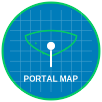

# Portal Map 🗺️

**Visualitzador especialitzat de marques i serveis a OpenStreetMap**

Portal Map és un visualitzador web d'OpenStreetMap enfocat en la visualització de marques i serveis específics, amb eines per explorar dades concretes del mapa.

## 🌟 Funcionalitats principals

### 🗺️ Visualitzador de mapes
- **Mapes base múltiples**: OpenStreetMap, MapTiler, Esri Sat,...
- **Estils vectorials**: MapTiler Basic, Versatiles colorful,...
- **Controls interactius**: zoom, coordenades, capa selector

### 🔍 Cerca i consultes
- **Filtres per tipus**: nodes, ways, relations
- **Estadístiques de consulta**: temps d'execució, recompte d'elements
- **Visualització de metadades**: informació d'usuari OSM, changesets

### 🌍 Suport multiidioma
- **3 idiomes disponibles**: Català, Castellà, Anglès
- **Sistema de traducció dinàmica** amb commutador d'idioma
- **Interfície adaptada** per a cada idioma

### 🔗 Integracions externes
**Eines d'edició OSM**:
- iD Editor, JOSM, Potlatch 2, RapiD Editor

**Mapes complementaris**:
- Google Maps, HERE WeGo, Bing Maps, Apple Maps
- OpenStreetMap principal

**Eines especialitzades**:
- MapComplete (direccions, parcs infantils, reciclatge)
- OSM Hydrants, Keep Right (validació)
- Waymarked Trails (rutes)
- OpenCampingMap, WheelMap (accessibilitat)

**Comunitat**:
- Latest OSM Edits, OSMCha (canvis recents)
- Notes a OSM, Geofabrik Tools

## 🛠️ Arquitectura tècnica

- **Frontend**: JavaScript amb OpenLayers 6.2.2
- **Dades**: API Overpass per consultes OSM en temps real
- **Mapes**: MapTiler (vectorial), Versatiles (estils personalitzats)
- **Translations**: Sistema propi de traducció dinàmica
- **Estil**: CSS responsive amb disseny adaptatiu

## 🚀 Com utilitzar

1. **Seleccionar mapa base**: Tria entre els diferents estils disponibles
2. **Visualitzar marques**: Activa els overlays de categories (animals, govern)
3. **Cercar elements**: Utilitza les consultes predefinides per categories
4. **Explorar detall**: Clica sobre elements per veure metadades OSM
5. **Canviar idioma**: Utilitza el selector per canviar entre CA/ES/EN

## 🌐 Demo en directe

**Prova Portal Map**: [https://yopaseopor.github.io/portalmap](https://yopaseopor.github.io/portalmap)

## 🎯 Procés de desenvolupament

### Vibe Coding Experience

Portal Map ha estat desenvolupat principalment utilitzant la tècnica de **vibe coding**, un enfocament creatiu i intuïtiu per al desenvolupament de programari que prioritza:

- **Experimentació ràpida** amb idees i funcionalitats
- **Integració creativa** de múltiples fonts d'inspiració
- **Desenvolupament iteratiu** basat en necessitats immediates
- **Adaptabilitat constant** als canvis i millores

#### Principals eines utilitzades:
- **Cursor** amb models com Claude Sonnet 3.5 i ChatGPT 4.0
- **Windsurf** amb ChatGPT 4.1, Deepseek, Gemini 2.5 , SWE-1 i code-supernova-1 million
- **Visual Studio Code** amb Copilot i ChatGPT 4.1

## 📄 Llicència

Open source - consulta el fitxer LICENSE per detalls.

## 🔗 Enllaços relacionats

- [OpenStreetMap](https://www.openstreetmap.org)
- [OpenLayers](https://openlayers.org)
- [Overpass API](https://overpass-api.de)
- [MapComplete](https://mapcomplete.org)

---

**Portal Map** - El teu portal especialitzat per explorar serveis a OpenStreetMap.
