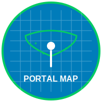

# Portal Map 🗺️

**Visualizador especializado de marcas y servicios en OpenStreetMap**

Portal Map es un visualizador web de OpenStreetMap enfocado en la visualización de marcas y servicios específicos, con herramientas para explorar datos concretos del mapa.

## 🌟 Funcionalidades principales

### 🗺️ Visualizador de mapas
- **Mapas base múltiples**: OpenStreetMap, MapTiler, Esri Sat,...
- **Estilos vectoriales**: MapTiler Basic, Versatiles colorful,...
- **Controles interactivos**: zoom, coordenadas, selector de capas

### 🔍 Búsqueda y consultas
- **Filtros por tipo**: nodos, vías, relaciones
- **Estadísticas de consulta**: tiempo de ejecución, recuento de elementos
- **Visualización de metadatos**: información de usuario OSM, cambios

### 🌍 Soporte multilingüe
- **3 idiomas disponibles**: Español, Catalán, Inglés
- **Sistema de traducción dinámica** con selector de idioma
- **Interfaz adaptada** para cada idioma

### 🔗 Integraciones externas
**Herramientas de edición OSM**:
- iD Editor, JOSM, Potlatch 2, RapiD Editor

**Mapas complementarios**:
- Google Maps, HERE WeGo, Bing Maps, Apple Maps
- OpenStreetMap principal

**Herramientas especializadas**:
- MapComplete (direcciones, parques infantiles, reciclaje)
- OSM Hydrants, Keep Right (validación)
- Waymarked Trails (rutas)
- OpenCampingMap, WheelMap (accesibilidad)

**Comunidad**:
- Últimos cambios en OSM, OSMCha
- Notas de OSM, Herramientas Geofabrik

## 🛠️ Arquitectura técnica

- **Frontend**: JavaScript con OpenLayers 6.2.2
- **Datos**: API Overpass para consultas OSM en tiempo real
- **Mapas**: MapTiler (vectorial), Versatiles (estilos personalizados)
- **Traducciones**: Sistema propio de traducción dinámica
- **Estilo**: CSS responsive con diseño adaptable

## 🚀 Cómo utilizar

1. **Seleccionar mapa base**: Elige entre los diferentes estilos disponibles
2. **Visualizar marcas**: Activa las capas de categorías (animales, gobierno)
3. **Buscar elementos**: Utiliza las consultas predefinidas por categorías
4. **Explorar detalles**: Haz clic sobre elementos para ver metadatos OSM
5. **Cambiar idioma**: Utiliza el selector para cambiar entre ES/CA/EN

## 🌐 Demo en directo

**Prueba Portal Map**: [https://yopaseopor.github.io/portalmap](https://yopaseopor.github.io/portalmap)

## 🎯 Proceso de desarrollo

### Experiencia Vibe Coding

Portal Map ha sido desarrollado principalmente utilizando la técnica de **vibe coding**, un enfoque creativo e intuitivo para el desarrollo de software que prioriza:

- **Experimentación rápida** con ideas y funcionalidades
- **Integración creativa** de múltiples fuentes de inspiración
- **Desarrollo iterativo** basado en necesidades inmediatas
- **Adaptabilidad constante** a los cambios y mejoras

#### Principales herramientas utilizadas:
- **Cursor** con modelos como Claude Sonnet 3.5 y ChatGPT 4.0
- **Windsurf** con ChatGPT 4.1, Deepseek, Gemini 2.5, SWE-1 y code-supernova-1 million
- **Visual Studio Code** con Copilot y ChatGPT 4.1

## 📄 Licencia

Código abierto - consulta el archivo LICENSE para más detalles.

## 🔗 Enlaces relacionados

- [OpenStreetMap](https://www.openstreetmap.org)
- [OpenLayers](https://openlayers.org)
- [Overpass API](https://overpass-api.de)
- [MapComplete](https://mapcomplete.org)

---

**Portal Map** - Tu portal especializado para explorar servicios en OpenStreetMap.
